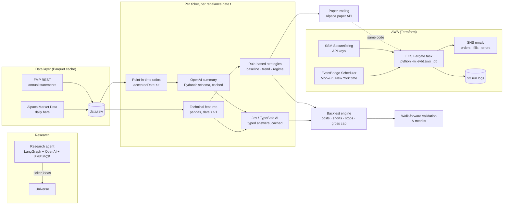

# jev-trader

**An end-to-end quantitative research platform for US equities — from hypothesis to backtest to live
paper trading in the cloud.** Technical indicators in pandas, LLM-assisted fundamental analysis, typed AI
decisions, a custom backtest engine with walk-forward validation, and a scheduled AWS deployment that trades an
Alpaca paper account every session and reports by email.


---

## Why this project is interesting

Most trading repos stop at a notebook with a pretty equity curve. This one treats strategy research as an
engineering problem — **reproducible, testable, honest about its results, and deployed**:

- **Full lifecycle in one codebase**: data ingestion → feature engineering → AI-assisted decisions → backtesting →
  walk-forward validation → forward paper trading → cloud scheduling, alerting and infrastructure as code.
- **Look-ahead bias is treated as a bug class.** Decisions only see data up to the previous close, fundamentals are
  filtered by *publication* date, LLM prompts are anonymized, and orders fill at the next open.
- **LLMs used where they help, with guardrails.** An OpenAI model summarizes financial statements into a validated
  Pydantic schema; Jev (TypeSafe AI) returns typed, probabilistic answers (probabilities, scores, choices) instead of
  free text. Every paid call goes through a deterministic disk cache, so re-running an experiment costs nothing.
- **Scientific honesty.** Every AI component must beat a no-LLM baseline; parameters were fixed before testing;
  results on unseen stocks are reported separately — including when the answer was "no edge".
- **Production-grade operations**: containerized job on ECS Fargate, EventBridge Scheduler, SNS email
  notifications, secrets in SSM, Terraform with remote S3 state, locking and an account guard.

## Architecture



## The live strategy

After testing LLM-driven rules, regime switches, stops and long/short variants (see [results](#results)), the
strategy trading the paper account today is deliberately simple and fully rule-based: **trade only stocks in a
confident trend, stay in cash otherwise.**

| Entry — all conditions must hold | Long |
|---|---|
| Price vs 200-day moving average | above, and the average itself rising |
| Persistence | ≥ 80% of the last 60 closes above the 200-day average |
| Trend quality | efficiency ratio (60d) ≥ 0.15 **and** ADX(14) ≥ 20 |
| Momentum | 3-month and 12-month returns positive, 50-day average above 200-day |
| Not over-extended | RSI(14) < 70 |

- **Exit** with hysteresis (a lower bar than entry): the trend breaks (price below the 200-day average with negative
  3-month momentum) or the 200-day average turns down. No stop-losses — they hurt in every test.
- **Sizing**: 1/12 of equity per position, gross exposure capped at 100%. Daily rebalancing, market-on-open orders.
- **Universe**: 50 US stocks across all 11 sectors, chosen by rule rather than past performance.
- Thresholds are round numbers fixed *before* testing and are not tuned on historical data — forward paper trading
  is the real test.

## Results

Backtests use split-adjusted daily bars (not dividend-adjusted), 10 bps per trade, decisions on data up to the
previous close and fills at the next open. Return / Sharpe / max drawdown, 2018–2026:

| Universe | Trend strategy (daily) | Baseline (close > SMA200) | Buy & hold |
|---|---|---|---|
| 26 stocks never used during development | **+205% / 0.77 / −24%** | +167% / 0.79 / −23% | +291% / 0.76 / −36% |
| All 50 stocks | **+395% / 0.95 / −25%** | +164% / 0.83 / −25% | +401% / 0.88 / −37% |

**What the research showed** (details in [CLAUDE.md](CLAUDE.md) §8):

- The trend filter **cuts the trade count 3–4× and lifts the hit rate from ~27% to ~41–46%**, with smaller
  drawdowns than buy & hold. On unseen stocks it is *not* clearly better than the simple baseline — reported as such.
- **LLM fundamentals hurt long entries** in this setup: accounting artifacts (e.g. acquisition amortization) made
  strong companies look weak. Removing the fundamental gates improved results every time.
- **Shorts pay in crashes, lose in rebounds**; fixed stop-losses destroyed returns (85% of stop-outs re-entered
  within a week); a **market-wide regime switch failed** in every period because index signals lag.
- Nothing beat buy & hold on raw return over 2018–2026; the edge, if any, is risk-adjusted. That is exactly why the
  strategy is now being judged on **live paper trading** rather than more backtests.

> Past performance — especially backtested — does not predict future results. This is a research project, not
> investment advice, and it trades a **paper** (simulated) account only.

## Tech stack

| Area | Tools |
|---|---|
| Language & data | Python 3.12, pandas, NumPy, PyArrow (Parquet cache), Pydantic |
| Market data | Alpaca Market Data API (prices), Financial Modeling Prep (fundamentals), FMP MCP (research) |
| AI | OpenAI via `langchain-openai` (structured output), Jev / TypeSafe AI via OpenRouter, LangGraph |
| Trading | Alpaca Trading API — paper endpoint only (enforced in code) |
| Cloud | AWS ECS Fargate, ECR, EventBridge Scheduler, SNS, S3, SSM Parameter Store, CloudWatch, IAM |
| Infrastructure | Terraform (S3 backend with native locking, workspaces, account guard), Docker |
| Web | FastAPI + React/Vite stock-discovery UI |
| Quality | pytest — 109 offline tests (synthetic data, mocked LLMs and brokers, no network) |

## Quick start

Requirements: Python 3.12, [uv](https://github.com/astral-sh/uv) (or pip), free Alpaca and FMP API keys.

```powershell
uv venv --python 3.12 .venv
uv pip install --python .venv -r requirements.txt -e .
Copy-Item .env.example .env            # add ALPACA_API_KEY_ID / ALPACA_API_SECRET_KEY, FMP_API_KEY (OpenAI/Jev optional)
.venv\Scripts\python -m pytest -q      # offline test suite, no API keys needed
```

Run a backtest:

```powershell
# Live strategy: trend-confidence, long only, daily rebalance, 1/12 per position, 100% gross cap
.venv\Scripts\python -m jevbt backtest --strategy trend --direction long --rebalance daily `
    --max-alloc 0.0833 --max-gross 1 --tickers AAPL MSFT NVDA XOM KO --start 2023-01-01 --end 2026-09-25

# No-LLM baseline (close > SMA200 and RSI < 70)
.venv\Scripts\python -m jevbt baseline --tickers AAPL MSFT --start 2023-01-01 --end 2026-09-25
```

Each run writes `data/runs/<timestamp>_<strategy>/` with `metrics.json`, `equity.csv`, `trades.csv` and
`decisions.jsonl` (every decision with its inputs and the resulting order).

<details>
<summary><b>More commands</b> — LLM strategies, walk-forward, shorts, stops, regime switch, research agent</summary>

```powershell
.venv\Scripts\python -m jevbt ingest --tickers AAPL MSFT --start 2021-01-01 --end 2025-12-31
.venv\Scripts\python -m jevbt backtest --tickers AAPL MSFT --start 2023-01-01 --end 2026-09-25 --offline  # mocked LLMs
.venv\Scripts\python -m jevbt backtest --tickers AAPL MSFT --start 2023-01-01 --end 2026-09-25            # OpenAI + Jev
.venv\Scripts\python -m jevbt walkforward --tickers AMZN --start 2023-01-01 --end 2026-09-25              # out-of-sample
.venv\Scripts\python -m jevbt walkforward --tickers AMD AAPL --start 2023-01-01 --end 2026-09-25 --direction both
.venv\Scripts\python -m jevbt baseline --tickers AMD --start 2023-01-01 --end 2026-09-25 --direction both --trailing-stop-atr 2 --stop-rearm
.venv\Scripts\python -m jevbt backtest --strategy regime --regime-index QQQ --bull baseline --bear jev --tickers AMD AAPL --start 2023-01-01 --end 2026-09-25
.venv\Scripts\python -m jevbt research "profitable US large caps with revenue growth" --seed AMZN MSFT
.venv\Scripts\python scripts\probe_fmp.py        # re-verify FMP endpoints and free-plan limits
```

Data is cached under `data/raw/` (Parquet) and paid answers under `data/cache/`; cached ranges never hit the network.
FMP requests are counted against a daily budget (`FMP_DAILY_BUDGET`, default 240 of the free 250).
</details>

## Paper trading

The same strategy code that runs in backtests produces live orders. The broker client refuses any host other
than Alpaca's paper endpoint, and nothing is sent without `--submit`.

```powershell
.venv\Scripts\python -m jevbt paper --tickers AMD NKE XOM KO --rebalance daily              # dry run: prints and logs orders
.venv\Scripts\python -m jevbt paper --tickers AMD NKE XOM KO --rebalance daily --submit     # sends them to the paper account
```

Orders are whole-share, market-on-open (`opg`, submit before 09:28 New York time); shorts are only sent for
shortable, easy-to-borrow stocks; every run is logged to `data/paper/`.

## Cloud deployment (AWS + Terraform)

`infra/terraform/` deploys the paper-trading job as a scheduled container:

- **EventBridge Scheduler** (Mon–Fri, America/New_York) starts an **ECS Fargate** task:
  09:00 `trade` (signals + market-on-open orders) and 10:00 `report` (fills).
- **SNS email**: orders submitted, positions opened/closed, unfilled orders, errors — Alpaca does not email
  paper-account fills, so notifications are built in. A weekly "no orders" summary confirms the job is alive.
- **Security & safety**: least-privilege IAM roles, API keys in SSM SecureString (never in Terraform state),
  private encrypted S3 buckets, outbound-only security group, remote state in a versioned S3 bucket with locking,
  and an `account_id` precondition that stops `plan`/`apply` if credentials belong to the wrong AWS account.
- **Cost**: a few cents per month (short Fargate runs, free-tier SNS/Scheduler).

```powershell
cd infra\terraform
Copy-Item terraform.tfvars.example terraform.tfvars      # profile, account id, email, tickers, rebalance
Copy-Item backend.hcl.example backend.hcl                # S3 state bucket (created once)
terraform init -backend-config=backend.hcl
terraform apply
# Store the Alpaca paper keys: aws ssm put-parameter --type SecureString --overwrite --name /jevbt/alpaca_api_key_id ...
docker build --platform linux/amd64 -f ..\..\docker\Dockerfile -t jevbt-paper:v2 ..\..
# docker login to ECR, then tag and push to <ecr_repository_url>:v2 (terraform output)
```

## Stock discovery UI

A React + Vite app (`ui/`) on a thin FastAPI layer lets you prompt the research agent and browse past runs.

```powershell
.venv\Scripts\python -m jevbt serve        # API on :8000 ($env:JEVBT_RESEARCH_MOCK="1" for canned answers)
cd ui; npm install; npm run dev            # UI on http://localhost:5173
```

## Project structure

```
src/jevbt/
  ingest/          Alpaca prices + FMP statements, Parquet cache, request budget
  features/        technical indicators (SMA, RSI, ATR, ADX, efficiency ratio…) and point-in-time fundamentals
  llm/ decision/   OpenAI fundamentals summarizer and Jev (TypeSafe AI) client, both disk-cached
  graph.py         LangGraph pipeline: fundamentals → state → decision
  strategy.py      baseline, Jev rules, trend-confidence and regime-switch strategies
  backtest/        engine (costs, shorts, stops, exposure cap), metrics, walk-forward validation
  broker/ paper.py Alpaca paper trading (paper endpoint only)
  aws_job.py       scheduled cloud job (trade / report + email)
  research/ api.py research agent (FMP MCP) and FastAPI backend
docker/            job image
infra/terraform/   AWS infrastructure
tests/             offline test suite (pytest)
ui/                React stock-discovery UI
```

Design decisions, data-source limits and the full research log live in [CLAUDE.md](CLAUDE.md).

## Engineering practices

- **Correctness first**: tests encode the invariants that matter in trading code — no look-ahead, fills at the next
  open, cost accounting, short P&L, flips, stops, exposure caps, paper-only broker, email reporting.
- **Reproducibility**: pinned model versions, deterministic caches keyed by input hash, fixed data feed per cache.
- **Cost control**: every paid API call is cached and budgeted; experiments re-run for free.
- **Safety by construction**: paper-only broker client, dry-run by default, account guard in Terraform, secrets
  never committed or stored in state.

## Roadmap

- Evaluate the strategy on accumulating forward paper-trading results.
- Faster re-entry after V-shaped crashes (the strategy's known weakness) — to be designed without fitting the past.
- Dividend-adjusted prices and a broader, survivorship-free universe.
- Per-stock regime detection and better fundamentals inputs (EBITDA-style margins, non-GAAP valuation).

## Author

**David Nevado Martín** — [github.com/dnevado](https://github.com/dnevado)

Feedback and questions are welcome via GitHub issues.

---

Released under the [MIT License](LICENSE).
